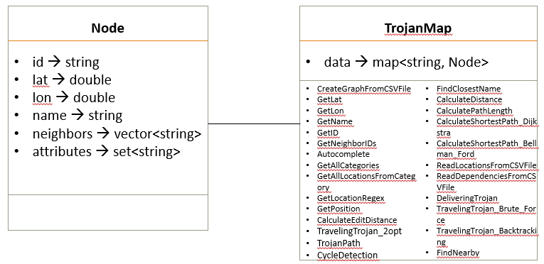
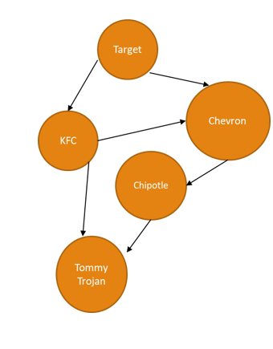
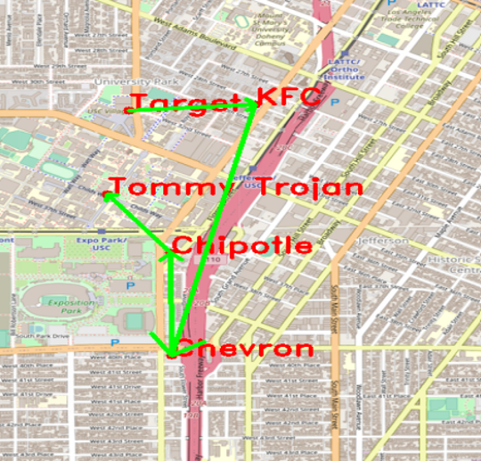

# EE538 Final Project - Fall 2022 - TrojanMap

    -> Author : Hardik Prajapati 
    -> Email : hprajapa@usc.edu 


#### Class Diagram:
<p align="center"></p>


## The Data Structure

Each point on the map is represented by the class **Node** shown below and defined in [trojanmap.h](src/lib/trojanmap.h).

```cpp
class Node {
 public:
  Node(){};
  Node(const Node &n) {
    id = n.id;
    lat = n.lat;
    lon = n.lon;
    name = n.name;
    neighbors = n.neighbors;
    attributes = n.attributes;
  };
  std::string id;    // A unique id assign to each point
  double lat;        // Latitude
  double lon;        // Longitude
  std::string name;  // Name of the location. E.g. "Bank of America".
  std::vector<std::string>
      neighbors;  // List of the ids of all neighbor points.
  std::unordered_set<std::string>
      attributes;  // List of the attributes of the location.
};
```

---

#### Outlook of the UI

```shell
TrojanMap Menu
**************************************************************
* Enter the function number (1-11) to start:                  
* 1. Autocomplete                                             
* 2. Find the location                                        
* 3. Find all location categories                             
* 4. Get all locations of a category                          
* 5. Get location matching regular expression                 
* 6. CalculateShortestPath                                    
* 7. Cycle Detection                                          
* 8. Topological Sort                                         
* 9. Traveling salesman problem                              
* 10. Find Nearby                                              
* 11. Find Path to Visit All Places
* 12. Exit                                                     
**************************************************************
```


## Item 1: Autocomplete The Location Name (Phase 1)

Example:

Input: "Chi" \
Output: ["Chick-fil-A", "Chipotle", "Chinese Street Food"]

Example:

```shell
**************************************************************
* 1. Autocomplete                                             
**************************************************************

Please input a partial location:ch
*************************Results******************************
Chinese Street Food
Cheebos Burger
Chick-fil-A
Chase
Chevron 1
Chipotle
Chase Plaza Heliport
Chevron 2
Church of Christ
Chucks Chicken & Waffles
Chevron
**************************************************************
Time taken by function: 2 ms
```

- What is the runtime of your algorithm? 
    -> O(n), where n is length of total locations (nodes) in our database
- (Optional) Can you do it faster than `O(n)`?
    -> Yes, this can be done using 'Trie' data structure. It would reduce time complexity from O(n) to O(d) where d=length of longest word starting with the given initials. 

## Item 2-1: Find the place's coordinates in the Map (Phase 1)

Example:

Input: "Target" \
Output: (34.0257016, -118.2843512)

```shell
**************************************************************
* 2. Find the position                                        
**************************************************************

Please input a location:Target
*************************Results******************************
Latitude: 34.0257 Longitude: -118.284
**************************************************************
Time taken by function: 1 ms
```

<p align="center"></p>

- What is the runtime of your algorithm? 
    -> O(n), where n is length of total locations (nodes) in our database

## Item 2-2: Check Edit Distance Between Two Location Names (Phase 2)

For example, if I type *Rolphs*, I should get a warning like "Did you mean *Ralphs* instead of *Rolphs*?". 

- What is the runtime of your algorithm? 
    -> O(p*q), where p=length of location 1, q=length of location 2

## FindClosestName


Input: "Rolphs", "Ralphs" \
Output: 1


Example:

Input: "Rolphs"\
Output: "Ralphs"

```shell
**************************************************************
* 2. Find the location                                        
**************************************************************

Please input a location:Rolphs
*************************Results******************************
No matched locations.
Did you mean Ralphs instead of Rolphs? [y/n]y
Latitude: 34.0318 Longitude: -118.291
**************************************************************
Time taken by function: 2 ms
```
- What is the runtime of your algorithm? 
    -> O(n * p * q) , where n is length of total locations (nodes) in our database and p=length of location 1, q=length of location 2

## Item 3: Get All Categories (Phase 2)


In this section, our program prints all available categories among all existing categories in the map. 

- What is the runtime of your algorithm? 
    -> O(n * d) , where n is length of total locations (nodes) in our database and d=max length of attribute set among all locations


## Item 4: Get All Locations In A Category (Phase 2)

In this section if the user entries a category, the program prints all locations that match that category. For example, if there is a category called "bank", our program prints all location ids that match the "bank" category. 

- What is the runtime of your algorithm? 
    -> O(n * 1) , where n is length of total locations (nodes) in our database.


## Item 5: Get Locations Using A Regular Expression (Phase 2)


In this section if the user enters a [regular expression](https://en.wikipedia.org/wiki/Regular_expression), they should see all location ids that match that regular expression.

Our program also verifies if the input regular expression was correct. 

- What is the runtime of your algorithm? 
    -> O(n) , where n is length of total locations (nodes) in our database


## Item 6: CalculateShortestPath between two places (Phase 2)


Given 2 locations A and B, the program finds the best route from A to B. The distance between 2 points is the euclidean distance using latitude and longitude. The program uses both Dijkstra algorithm and Bellman-Ford algorithm. The time comparison for the different methods is as below. The program show the routes on the map. 


**The runtime of the algorithm for several examples.**

| Point A to Point B      | Dijkstra | Bellman Ford|
| -------------------- | ----------- |-------|
| Cava - Chipotle      |  63         | 67459 |
| -------------------- | ----------- |-------|
| KFC - Chevron        |  239        | 78777 |
| -------------------- | ----------- |-------|
| Pico - Dulce         |  226        |104080 |
| -------------------- | ----------- |-------|

Example
```
**************************************************************
* 6. CalculateShortestPath                                    
**************************************************************

Please input the start location:Ralphs
Please input the destination:Target
*************************Dijkstra*****************************
*************************Results******************************
"2578244375","4380040154","4380040158","4380040167","6805802087","8410938469","6813416131","7645318201","6813416130","6813416129","123318563","452688940","6816193777","123408705","6816193774","452688933","452688931","123230412","6816193770","6787470576","4015442011","6816193692","6816193693","6816193694","4015377691","544693739","6816193696","6804883323","6807937309","6807937306","6816193698","4015377690","4015377689","122814447","6813416159","6813405266","4015372488","4015372487","6813405229","122719216","6813405232","4015372486","7071032399","4015372485","6813379479","6813379584","6814769289","5237417650",
The distance of the path is:0.927969 miles
**************************************************************
Time taken by function: 39 ms

*************************Bellman_Ford*************************
*************************Results******************************
"2578244375","4380040154","4380040158","4380040167","6805802087","8410938469","6813416131","7645318201","6813416130","6813416129","123318563","452688940","6816193777","123408705","6816193774","452688933","452688931","123230412","6816193770","6787470576","4015442011","6816193692","6816193693","6816193694","4015377691","544693739","6816193696","6804883323","6807937309","6807937306","6816193698","4015377690","4015377689","122814447","6813416159","6813405266","4015372488","4015372487","6813405229","122719216","6813405232","4015372486","7071032399","4015372485","6813379479","6813379584","6814769289","5237417650",
The distance of the path is:0.927969 miles
**************************************************************
Time taken by function: 7084 ms
```

<p align="center"></p>

- What is the runtime of your algorithm? 
    -> Dijkstra: O(V^2) , where V = total locations (nodes) visited.
    -> Bellman Ford: O(E*V), where E = number of paths observed between locations and V = number of locations visited.   


## Item 7: Cycle Detection (Phase 2)

In this section, we use a square-shaped subgraph of the original graph by using four coordinates stored in ```std::vector<double> square```, which follows the order of left, right, upper, and lower bounds. 

Then try to determine if there is a cycle path in the that subgraph.
If it does, we return true and report the path of the cycle on the map. Otherwise return false.

Example 1:
```shell
Input: square = {-118.299, -118.264, 34.032, 34.011}
Output: true
```
Here we use the whole original graph as our subgraph. 
<p align="center"></p>

Example 2:
```shell
Input: square = {-118.290, -118.289, 34.030, 34.020}
Output: false
```
Here we use a square area inside USC campus as our subgraph
<p align="center"></p>

```shell
5
**************************************************************
* 5. Cycle Detection                                          
**************************************************************

Please input the left bound longitude(between -118.320 and -118.250):-118.299
Please input the right bound longitude(between -118.320 and -118.250):-118.264
Please input the upper bound latitude(between 34.000 and 34.040):34.032
Please input the lower bound latitude(between 34.000 and 34.040):34.011
*************************Results******************************
there exists a cycle in the subgraph 
**************************************************************
Time taken by function: 0 ms

5
**************************************************************
* 5. Cycle Detection                                          
**************************************************************

Please input the left bound longitude(between -118.320 and -118.250):-118.290
Please input the right bound longitude(between -118.320 and -118.250):-118.289
Please input the upper bound latitude(between 34.000 and 34.040):34.030
Please input the lower bound latitude(between 34.000 and 34.040):34.020
*************************Results******************************
there exist no cycle in the subgraph 
**************************************************************
Time taken by function: 0 ms
```
- What is the runtime of your algorithm? 
    -> O(n) , where n = total locations (nodes) in the subgraph.


## Item 8: Topological Sort (Phase 2)

In this section, we assume that we are using a UAV which means we can fly directly from 1 point to another point. Tommy Trojan got a part-time job from TrojanEats, for which he needs to pick up and deliver food from local restaurants to various location near the campus. Tommy needs to visit a few different location near the campus with certain order, since there are some constraints. For example, he must first get the food from the restaurant before arriving at the delivery point. 

The TrojanEats app will have some instructions about these constraints. So, the app will help him figure out the feasible route!

Here we will give you a vector of location names that Tommy needs to visit, and also some dependencies between those locations.


For example, 

```shell
Input: 
location_names = {"Ralphs", "Chick-fil-A", "KFC"}
dependencies = {{"Ralphs","KFC"}, {"Ralphs","Chick-fil-A"}, {"Chick-fil-A", "KFC"}}
```

Here, ```{"Ralphs","KFC"}``` means
that Tommy must go to `Ralphs` prior to `KFC`.

Output:
```shell
Output: Ralphs  -> Chick-fil-A -> KFC
```
Also, we provide ```PlotPointsOrder``` function that can visualize the results on the map. It will plot each location name and also some arrowed lines to demonstrate a feasible route.


Below is an example output of 3 nodes
```shell
*************************Results******************************
Topological Sorting Results:
Ralphs
Chick-fil-A
KFC
**************************************************************
Time taken by function: 2 ms
```
<p align="center"></p>

In the user interface, we read the locations and dependencies from `topologicalsort_dependencies.csv` and `topologicalsort_locations.csv` to modify your input there.

## Eg1:
<p align="center"></p>

<p align="center"></p>


- What is the runtime of your algorithm? 
    -> O(n) , where n = total locations (nodes) to be visited.


## Item 9: The Traveling Trojan Problem (AKA Traveling Salesman!) (Phase 3)

In this section, we assume that we are using a UAV which means we can fly directly from 1 point to another point. Given a vector of location ids, assume every location can reach all other locations in the vector (i.e. assume that the vector of location ids is a complete graph).
Find the shortest route that covers all the locations exactly once and goes back to the start point. 

You will need to return the progress to get the shortest route which will then be converted to an animation.  

We will use the following algorithms:

- Brute-force (i.e. generating all permutations, and returning the minimum)
```c++
std::pair<double, std::vector<std::vector<std::string>>> TravelingTrojan_Brute_force(
      std::vector<std::string> location_ids);
```
- Brute-force enhanced with early backtracking
```c++
std::pair<double, std::vector<std::vector<std::string>>> TravelingTrojan_Backtracking(
      std::vector<std::string> location_ids);
```
- [2-opt Heuristic](https://en.wikipedia.org/wiki/2-opt). Also see [this paper](http://cs.indstate.edu/~zeeshan/aman.pdf)
```c++
std::pair<double, std::vector<std::vector<std::string>>> TravelingTrojan_2opt(
      std::vector<std::string> location_ids);
```

We use early backtracking when the current cost is higher than current minimum.

Please report and compare the time spent by these 3 algorithms. 2-opt algorithm may not get the optimal solution. Please show how far your solution is from the optimal solution.

Show the routes on the map. For each intermediate solution, create a new plot. Your final video presentation should include the changes to your solution.

We will randomly select N points in the map and run your program.

```shell
**************************************************************
* 9. Traveling salesman problem                              
**************************************************************

In this task, we will select N random points on the map and you need to find the path to travel these points and back to the start point.

Please input the number of the places:8
"8201681442","6197156485","7786565237","6820972477","6807600525","1832234142","6819144993","1873055949",
Calculating ...
*************************Results******************************
TravelingTrojan_Brute_force
"8201681442","1873055949","6197156485","1832234142","6807600525","6819144993","7786565237","6820972477","8201681442",
The distance of the path is:7.94756 miles
**************************************************************
You could find your animation at src/lib/output.avi.          
Time taken by function: 59 ms

Calculating ...
*************************Results******************************
TravelingTrojan_Backtracking
"8201681442","6820972477","7786565237","6819144993","6807600525","1832234142","6197156485","1873055949","8201681442",
The distance of the path is:7.94756 miles
**************************************************************
You could find your animation at src/lib/output_backtracking.avi.
Time taken by function: 20 ms

Calculating ...
*************************Results******************************
TravelingTrojan_2opt
"8201681442","1873055949","6197156485","1832234142","6807600525","6819144993","7786565237","6820972477","8201681442",
The distance of the path is:7.94756 miles
**************************************************************
You could find your animation at src/lib/output_2opt.avi.     
Time taken by function: 0 ms
```

<p align="center"></p>

<p align="center"></p>


## Item 10: Find Nearby (Phase 3)

Given an attribute name `C`, a location name `L` and a number `r` and `k`, find at most `k` locations in attribute `C` on the map near `L`(do not include `L`) with the range of `r` and return a vector of string ids. 

The order of locations should be from
nearest to farthest, and you should not include the current location. 

```c++
std::vector<std::string> TrojanMap::FindNearby(std::string attributesName, std::string name, double r, int k);
```

All attributes:
```
'artwork', 'attraction', 'bakery', 'bank', 'bar', 'beauty', 'beverages', 'bicycle', 'bicycle_rental', 'bus_station', 
'cafe', 'car', 'car_repair', 'car_wash', 'charging_station', 'childcare', 'clinic', 'clothes', 'confectionery', 
'convenience', 'copyshop', 'dentist', 'department_store', 'driving_school', 'fabric', 'fast_food', 'food_court', 
'fountain', 'fuel', 'gallery', 'hairdresser', 'hospital', 'hotel', 'library', 'marketplace', 'mobile_phone', 'museum', 
'music', 'optician', 'parcel_locker', 'parking', 'pharmacy', 'place_of_worship', 'police', 'post_office', 
'restaurant', 'school', 'shoe_repair', 'shoes', 
'skate', 'social_facility', 'supermarket', 'theatre', 
'tobacco', 'yes', 'yoga'
```


Please report and compare the time spent by this algorithm and show the points on the map.

```shell
**************************************************************
* 10. Find Nearby                                    
**************************************************************

Please input the attribute:supermarket
Please input the locations:Ralphs
Please input radius r:10
Please input number k:10
*************************Results******************************
Find Nearby Results:
1 Trader Joes
2 Cal Mart Beer & Wine Food Store
3 Food 4 Less
**************************************************************
Time taken by function: 5 ms
```

<p align="center"></p>

## Item 11: Find the Shortest Path to Visit All locations (Phase 3)

Given an vector of locations, you need to find the shortest path to visit all the locations.

```c++
std::vector<std::string> TrojanMap::TrojanPath(std::vector<std::string> &location_names)
```

Please report and compare the time spent by this algorithm and show the points on the map.

```shell
**************************************************************
* 11. Shortest Path to Visit all Nodes                        
**************************************************************

Please input the locations filename:
*************************Results******************************
"3088547686","4835551100","4835551099","4835551098","6813565307","6813565306","6813565305","6813565295","6813565296","3402814832","4835551107","6813379403","6813379533","3402814831","6813379501","3402810298","6813565327","3398574883","6813379494","6813379495","6813379544","6813379545","6813379536","6813379546","6813379547","6814916522","6814916523","1732243620","4015372469","4015372463","6819179749","1732243544","6813405275","348121996","348121864","6813405280","1472141024","6813411590","216155217","6813411589","1837212103","1837212101","6814916516","6814916515","6820935910","4547476733","6820935910","6814916515","6814916516","1837212101","6813411588","4015372458","1837212100","6820935907","2753199985","1837212107","1837212104","4015405543","4015405542","1781230449","1781230450","6820935898","6813379556","6820935901","6820935900","6819179753","4540763379","3233702827","1862347583","5231967015","4399697302","4399697304","6807762271","122728406","6787673296","123209598","6814958391","4399697589","4872897515","602606656","3402887080","6814958394","3402887081","6813379483","6813379589","6352865690","4015203127","4015203129","3195897587","4015203132","6389467809","21098539","4015203133","4015203134","4015203136","123152294","6816193786","6816193785","6808069740","6813416155","6813416151","6813416152","6813416153","6813416154","6813416145","7232024780","6818427916","6818427917","6818427898","6818427892","6818427918","6818427919","6818427920","4380040148","4380040152","4380040153","4380040154","2578244375",
The distance of the path is:2.26759 miles
Time taken by function: 233 ms
```

<p align="center"></p>

## Reporting Runtime:
For each menu item, your program should show the time it took to finish each task.

Please make sure to provide various examples when you report the runtime. For example for topological sort, show an example with few nodes and another example with 10 or more nodes. The idea is to see how your runtime grows as input size grows.

## Runtime Comparison
For shortest path algorithms, you should compare solving the same problem with different algorithms (Dijkstra and Bellman-Ford). 
Please show the results on at least 3 different examples.

Similarly for the TSP problem, please provide various examples that show the runtime comparison. In particular, you should show at what point using the exhaustive search is not practical and compare the same input with the heuristic implementation.

**Please provide a table like below that compares the runtime of your algorithms for different number of nodes:**

| Number of nodes      | Time with algorithm 1 | Time with algorithm 2|
| -------------------- | ----------- |----|
|             |  t1        | t2    |

Your table should show have at least 15 rows.

